[toc]

### 总结

#### 1、文件类型（有7种文件）

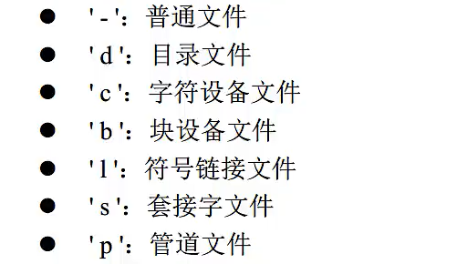

#### 2、获取文件属性：stat函数

##### 1、原型

```C
int stat(const char *pathname, struct stat *buf);
/*重点是struct stat 这个结构体*/
```

结果(记得要先创建一个test.txt文件)

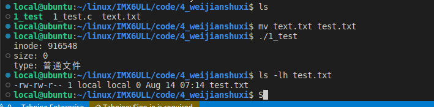

代码

```C
#include <sys/types.h>
#include <sys/stat.h>
#include <fcntl.h>
#include <unistd.h>
#include <stdio.h>
#include <stdlib.h>


int main(void)
{
    struct stat st;
    int ret = 0;

    /*stat获取文件的属性，将文件的属性信息存到st变量中*/
    ret = stat("./test.txt", &st);
    if (-1 == ret) {
        perror("stat error");
        return 1;
    }

    printf("inode: %ld\n", st.st_ino);//inode编号
    printf("size: %ld\n", st.st_size);//文件类型
    printf("type: ");

    if (S_ISREG(st.st_mode)) {
        printf("普通文件");
    } else if (S_ISDIR(st.st_mode)) {
        printf("目录");
    } else if (S_ISCHR(st.st_mode)) {
        printf("字符设备");
    } else if (S_ISBLK(st.st_mode)) {
        printf("块设备");
    } else if (S_ISFIFO(st.st_mode)) {
        printf("管道");
    } else if (S_ISLNK(st.st_mode)) {
        printf("链接");
    } else if (S_ISSOCK(st.st_mode)) {
        printf("套接字");
    }

    printf("\n");
    return 0;
}
```

##### 2、stat()的两个变体函数（获取文件属性：fstat()/lstat()函数）

1、fstat()原型

结果

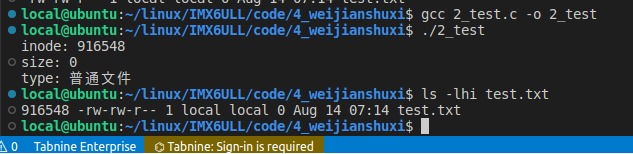

代码

```C
#include <sys/types.h>
#include <sys/stat.h>
#include <fcntl.h>
#include <unistd.h>
#include <stdio.h>
#include <stdlib.h>


int main(void)
{
    struct stat st;
    int ret = 0;
    int fd = 0;


    /*调用fstat函数之前 需要先打开这个文件*/
    fd = open("./test.txt", O_RDWR);
    if (-1 == fd) {
        perror("open error");
        return 1;
    }

    /*stat获取文件的属性，将文件的属性信息存到st变量中*/
    ret = fstat(fd, &st);
    if (-1 == ret) {
        perror("stat error");
        return 1;
    }

    printf("inode: %ld\n", st.st_ino);//inode编号
    printf("size: %ld\n", st.st_size);//文件类型
    printf("type: ");

    if (S_ISREG(st.st_mode)) {
        printf("普通文件");
    } else if (S_ISDIR(st.st_mode)) {
        printf("目录");
    } else if (S_ISCHR(st.st_mode)) {
        printf("字符设备");
    } else if (S_ISBLK(st.st_mode)) {
        printf("块设备");
    } else if (S_ISFIFO(st.st_mode)) {
        printf("管道");
    } else if (S_ISLNK(st.st_mode)) {
        printf("链接");
    } else if (S_ISSOCK(st.st_mode)) {
        printf("套接字");
    }

    printf("\n");
    return 0;
}
```


2、lstat()原型

结果

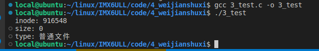

代码

```C
#include <sys/types.h>
#include <sys/stat.h>
#include <fcntl.h>
#include <unistd.h>
#include <stdio.h>
#include <stdlib.h>


int main(void)
{
    struct stat st;
    int ret = 0;

    /*stat获取文件的属性，将文件的属性信息存到st变量中*/
    ret = lstat("./test.txt", &st);//这里变了
    if (-1 == ret) {
        perror("stat error");
        return 1;
    }

    printf("inode: %ld\n", st.st_ino);//inode编号
    printf("size: %ld\n", st.st_size);//文件类型
    printf("type: ");

    if (S_ISREG(st.st_mode)) {
        printf("普通文件");
    } else if (S_ISDIR(st.st_mode)) {
        printf("目录");
    } else if (S_ISCHR(st.st_mode)) {
        printf("字符设备");
    } else if (S_ISBLK(st.st_mode)) {
        printf("块设备");
    } else if (S_ISFIFO(st.st_mode)) {
        printf("管道");
    } else if (S_ISLNK(st.st_mode)) {
        printf("链接");
    } else if (S_ISSOCK(st.st_mode)) {
        printf("套接字");
    }

    printf("\n");
    return 0;
}
```

#### 3、用户和用户组

##### 1、chown的使用

结果

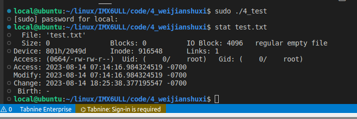

代码

```C
#include <sys/types.h>
#include <sys/stat.h>
#include <fcntl.h>
#include <unistd.h>
#include <stdio.h>
#include <stdlib.h>

/**
 * @brief 修改用户和用户组为0 使用stat查看 执行时记得加sudo
 * 
 * @return int 
 */
int main(void)
{
    int ret = 0;

    /*他这个文件的用户名和用户组修改为0 为root*/
    //两个0 代表uid和gid
    chown("./test.txt", 0, 0);
    if (-1 == ret) {
        perror("chown error");
        return 1;
    }

    return 0;
}
```

##### 2、用户权限


##### 3、access函数

结果

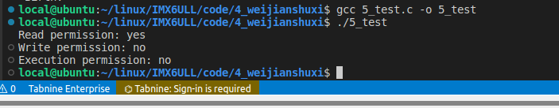

代码

```C
#include <sys/types.h>
#include <sys/stat.h>
#include <fcntl.h>
#include <unistd.h>
#include <stdio.h>
#include <stdlib.h>

#define MY_FILE "./test.txt"

/**
 * @brief 这样只有可以知道root用户 所以其他用户只有可读
 * 
 * @return int 
 */
int main(void)
{
    int ret = 0;

    /*检查文件是否存在*/
    ret = access(MY_FILE, F_OK);
    if (-1 == ret) {
        printf("%s: file does not exit.\n",MY_FILE);
        return 1;
    }
    /*检查权限*/
    ret = access(MY_FILE, R_OK);
    if (!ret) {
        printf("Read permission: yes\n");
    } else {
        printf("Read permission: no\n");
    }

    ret = access(MY_FILE, W_OK);
    if (!ret) {
        printf("Write permission: yes\n");
    } else {
        printf("Write permission: no\n");
    }

    ret = access(MY_FILE, X_OK);
    if (!ret) {
        printf("Execution permission: yes\n");
    } else {
        printf("Execution permission: no\n");
    }

    return 0;

}
```

##### 4、chmod函数

结果

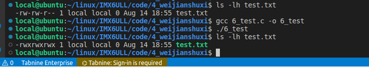

代码

```C
#include <sys/types.h>
#include <sys/stat.h>
#include <fcntl.h>
#include <unistd.h>
#include <stdio.h>
#include <stdlib.h>
/**
 * @brief 修改文件权限 
 * 
 * @return int 
 */
int main(void)
{
    int ret = 0;

    ret = chmod("./test.txt", 0777);//8进制 777是最大权限
    if (-1 == ret) {
        perror("open error");
        return 1;
    }

    return 0;
}
```

##### 5、umask查看权限掩码

#### 4、文件的时间属性

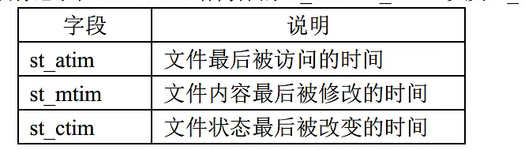

1、指定文件的时间属性

代码

```C
#include <sys/types.h>
#include <sys/stat.h>
#include <fcntl.h>
#include <unistd.h>
#include <stdio.h>
#include <stdlib.h>
#include <utime.h>

/**
 * @brief 修改文件的时间属性
 * 
 * @return int 
 */
int main(void)
{
    int ret = 0;

    /*调用utime将文件的时间修改为当前的系统时间*/
    ret = utime("./test.txt", NULL);
    if (-1 == ret) {
        perror("utime error");
        return 1;
    }
    return 0;
}
```

##### 2、futimens()、utimensat()修改时间属性

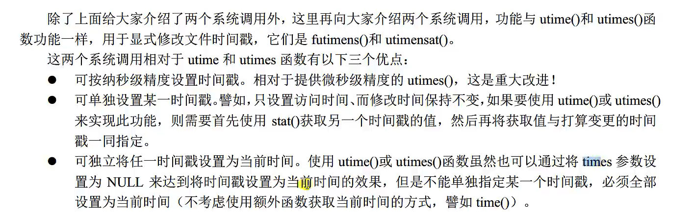

效果

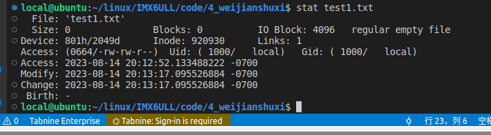

有三种可能（修改时间）代码

```C
#include <sys/types.h>
#include <sys/stat.h>
#include <fcntl.h>
#include <unistd.h>
#include <stdio.h>
#include <stdlib.h>
#include <utime.h>
#include <time.h>
#include <sys/time.h>

#define MY_FILE "./test1.txt"

/**
 * @brief 有三种不同的修改时间，也就是结果中的三个时间有的不修改，有的修改
 * 
 * @return int 
 */
int main(void)
{
    struct timespec tmsp_arr[2];
    int ret = 0;
    int fd = 0;

    /*打开文件*/
    fd = open(MY_FILE, O_RDWR);
    if (-1 == fd) {
        perror("open error");
        return 1;
    }

#if 0
    ret = futimens(fd, NULL);//同时设置为当前时间
    printf("#if 1\n");
#endif

#if 1
    tmsp_arr[0].tv_nsec = UTIME_OMIT;//访问时间保持不变
    tmsp_arr[1].tv_nsec = UTIME_NOW;//内容修改时间保持不变
    ret = futimens(fd, tmsp_arr);
    printf("#if futimens\n");
#endif

#if 0
    tmsp_arr[0].tv_nsec = UTIME_NOW;//访问时间设置为当前时间
    tmsp_arr[1].tv_nsec = UTIME_OMIT;//内容修改时间保持不变
    ret = futimens(fd, tmsp_arr);
#endif

    if (-1 == ret) {
        perror("futimens error");
        return 1;
    }

    close(fd);
    return 0;

}
```

##### 2、utimensat（）函数

效果

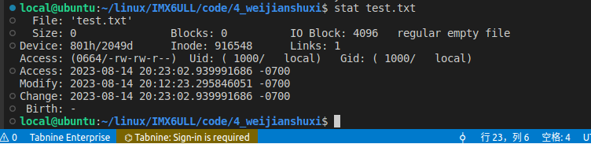

代码

```C
#include <sys/types.h>
#include <sys/stat.h>
#include <fcntl.h>
#include <unistd.h>
#include <stdio.h>
#include <stdlib.h>
#include <utime.h>
#include <time.h>
#include <sys/time.h>

#define MY_FILE "./test.txt"

/**
 * @brief 有三种不同的修改时间，也就是结果中的三个时间有的不修改，有的修改
 * 
 * @return int 
 */
int main(void)
{
    struct timespec tmsp_arr[2];
    int ret = 0;
    int fd = 0;

#if 0
    ret = utimensat(AT_FDCWD, "./test.txt", NULL, 0);//同时设置为当前时间
    printf("#if 1\n");
#endif

#if 0
    tmsp_arr[0].tv_nsec = UTIME_OMIT;//访问时间保持不变
    tmsp_arr[1].tv_nsec = UTIME_NOW;//内容修改时间保持不变
    ret = utimensat(AT_FDCWD, "./test.txt", tmsp_arr, 0);
    printf("#if utimensat\n");
#endif

#if 1
    tmsp_arr[0].tv_nsec = UTIME_NOW;//访问时间设置为当前时间
    tmsp_arr[1].tv_nsec = UTIME_OMIT;//内容修改时间保持不变
    ret = utimensat(AT_FDCWD, "./test.txt", tmsp_arr, 0);
#endif

    if (-1 == ret) {
        perror("utimensat error");
        return 1;
    }

    close(fd);
    return 0;

}
```

#### 5、符号链接（软链接）

```C
/*创建硬链接：link()
 *创建软链接：symlink()
 *读取软链接：readlink()
*/

//硬链接是直接使用：ln test.txt hard_file   最后一个是硬链接的自定义名字
//硬链接inode编号是一样的(表示同一个文件)

//软链接相当于快捷方式 里面存放的是地址(若源文件删除后，软链接就成了悬空链接(不存在的文件的软链接))
//软链接：ln -s test.txt soft_file (inode编号不一样，表示不同文件)
```

##### 1、创建硬链接/软链接代码

```C
#include <stdio.h>
#include <stdlib.h>
#include <unistd.h>

/**
 * @brief 创建一个硬链接/软链接
 * 
 * @return int 
 */
int main(void)
{
    int ret = 0;
    
    //ret = link("./test.txt", "hard_test");
    ret = symlink("./test.txt", "./sym_file");
    if (-1 == ret) {
        perror("link error");
        return 1;
    }

    return 0;
}
```

##### 2、读取软链接

结果

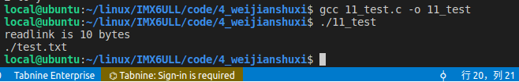

代码

```C
#include <stdio.h>
#include <stdlib.h>
#include <unistd.h>

/**
 * @brief buf是保存的路径
 * 
 * @return int 
 */
int main(void)
{
    int ret = 0;
    char buf[128] = {0};

    ret = readlink("./sym_file", buf, 128);
    if (-1 == ret) {
        perror("readlink error");
        return 1;
    }

    printf("readlink is %d bytes\n", ret);
    printf("%s\n", buf);

    return 0;
}
```

#### 6、目录

```C
//创建和删除目录：mkdir()、rmdir()
//打开、读取以及关闭目录：opendir()、readdir()、closedir()
//进程的工作目录
```

##### 1、创建一个目录

```C
#include <stdio.h>
#include <stdlib.h>
#include <unistd.h>
#include <sys/types.h>
#include <sys/stat.h>


/**
 * @brief 创建一个目录
 * 
 * @return int 
 */
int main(void)
{
    int ret = 0;
    ret = mkdir("./new_dir", 0666);
    if (-1 == ret) {
        perror("mkdir error");
        return 1;
    }

    return 0;
}
```

##### 2、删除一个目录(rmdir智能删除一个空目录)

```C
#include <stdio.h>
#include <stdlib.h>
#include <unistd.h>


/**
 * @brief 删除一个目录
 * 
 * @return int 
 */
int main(void)
{
    int ret = 0;

    ret = rmdir("./new_dir");
    if (-1 == ret) {
        perror("rmdir error");
        return 1;
    }

    return 0;
}
```

##### 3、读取目录

```C
#include <stdio.h>
#include <stdlib.h>
#include <unistd.h>
#include <errno.h>
#include <dirent.h>
#include <sys/types.h>

/**
 * @brief 读取目录
 * 
 * @return int 
 */

int main(void)
{
    DIR *dir = NULL;
    struct dirent *rent;
    int ret = 0;

//打开当前目录
    dir = opendir("./");
    if (NULL == dir) {
        perror("opendir error");
        return 1;
    }

//读取目录 打印inode和编号
    while (rent = readdir(dir)) {
        printf("%s : %ld\n", rent->d_name, rent->d_ino);
    }

    if (NULL == rent) {
        if (0 != errno) {
            perror("readdir error");
        } else {
            //到达目录结尾
            printf("end-of-dir\n");

        }
    }

    closedir(dir);
    return 0;
}
```

##### 4、改变进程的当前工作目录

结果

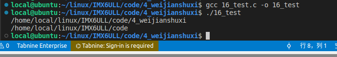

代码

```C
#include <stdio.h>
#include <stdlib.h>
#include <unistd.h>
#include <string.h>


/**
 * @brief 改变进程的当前工作目录
 * 
 * @return int 
 */
int main(void)
{
    char buf[128] = {0};

//获取当前的工作目录
    getcwd(buf, sizeof(buf));
    printf("%s\n", buf);

//修改当前的进程工作目录 
    chdir("../");
    getcwd(buf, sizeof(buf));
    printf("%s\n", buf);


    return 0;
}
```

##### 5、删除目录(unlink删除硬链接)/(remove删除空目录)还有个rename()

```C
#include <stdio.h>
#include <stdlib.h>
#include <unistd.h>
#include <sys/types.h>
#include <sys/stat.h>
#include <fcntl.h>
#include <unistd.h>

int main(void)
{
    int ret = 0;

    ret = unlink("./test.txt");
    if (-1 == ret) {
        perror("unlink error");
        return 1;
    }

    return 0;
}
```

2、要删除要记得先创建一个空文件

创建

```C
#include <stdio.h>
#include <stdlib.h>
#include <unistd.h>
#include <sys/types.h>
#include <sys/stat.h>


/**
 * @brief 创建一个目录
 * 
 * @return int 
 */
int main(void)
{
    int ret = 0;
    ret = mkdir("./new_dir", 0666);
    if (-1 == ret) {
        perror("mkdir error");
        return 1;
    }

    return 0;
}
```

删除

```C
#include <stdio.h>
#include <stdlib.h>
#include <unistd.h>
#include <sys/types.h>
#include <sys/stat.h>
#include <fcntl.h>
#include <unistd.h>

/**
 * @brief 删除空文件夹
 * 
 * @return int 
 */
int main(void)
{
    int ret = 0;

    ret = remove("./new_dir");
    if (-1 == ret) {
        perror("remove error");
        return 1;
    }

    return 0;
}
```

