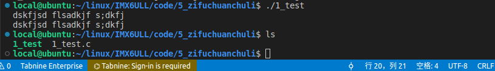
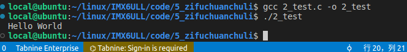
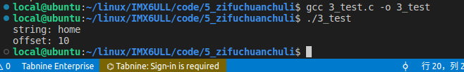

[toc]

### 总结

#### 1、字符串处理函数

> 1、puts()函数（用来向标准输出设备(屏幕、显示器)输出字符串并自行换行。
>
> 2、putchar()函数可以把参数c指定的字符（一个无符号字符）输出到标准输出设备，其输出可以是一个字符，可以是介于0~127之间的一个十进制整型数，也可以是用char类型定义号的一个字符型变量。
>
> 3、fputc()可把字符输出到指定的文件中，既可以是标准输出、标准错误设备、也可以是一个普通文件。
>
> 4、fputs()可把字符串输出到指定的文件中，既可以是标准输出、标准错误设备、也可以是一个普通文件。
>
> 5、少用gets()函数。可能会出现bug，导致程序在某些意外情况下会导致程序陷入不可控状态。
>
> 不同于scanf(),即使输入有空格后面的内容也会被输出
>
> 
>
> 6、getchar()每次调用只能读取到一个字符，无论输入多少都是只读取最前面的第一个字符
>
> 7、fgets()用于获取输入的字符串，会自动换行，输入多少，输出多少。空格也可以连上。
>
> 8、fgetc()函数，可以指定输入字符的文件，既可以从标准输入设备输入字符，也可以从一个普通文件中输入字符，其他方面和getchar函数相同。（也只能读取单个字符）

全部代码

```C
#include <stdio.h>

/**
 * @brief 这是大多数的c库函数
 * 
 * @return int 
 */
int main(void)
{
    //puts("Hello World");//自动换行

#if 0
    putchar('A');
    putchar('B');
    putchar('C');
    putchar('D');
    putchar(100);//输出是b,函数里面的参数是b的ascii码
    putchar('\n');
#endif

#if 0
    fputc('A', stdout);
    fputc('B', stdout);
    fputc('\n', stdout);
#endif

    //fputs("hello world\n", stdout);
#if 0
    char buf[128] = {0};
    gets(buf);//像scanf一样会要输入数据
    puts(buf);
#endif

#if 0
    int ch = 0;
    ch = getchar();
    printf("ch: %c\n", ch);
#endif

#if 0
    char str[100] = {0};

    printf("请输入字符串：");
    fgets(str, sizeof(str), stdin);//这里面包含了换行符
    printf("%s", str);
#endif

    int ch = 0;
    
    ch = fgetc(stdin);
    printf("%c\n", ch); //字符串，只能读取单个字符
    return 0;
}
```

#### 2、字符串拼接、拷贝、内存填充

##### 1、字符串拼接：strcat()/strncat()函数用于将两个字符串连接起来。

效果



代码

```c
#include <stdio.h>
#include <stdlib.h>
#include <string.h>

int main(void)
{
    char *str = "World";
    char buf[128] = {'H', 'e', 'l', 'l', 'o', ' '};

    strcat(buf, str);//字符串拼接
    puts(buf);

    return 0;
}
```

##### 2、拷贝strcpy()/strncpy()

```C
#include <stdio.h>
#include <stdlib.h>
#include <string.h>

int main(void)
{
    char buf[128] = {0};

    strcpy(buf, "hello world liutao");
    puts(buf);
    
    return 0;
}

```

##### 3、内存填充(memset()函数（可以将某一块内存中的数据全部设置为指定的值))

```C
#include <stdio.h>
#include <stdlib.h>
#include <string.h>

int main(void)
{
    char buf[128] = {0};

    memset(buf, 0x0, sizeof(buf));//以上两步做的是同一个操作

    return 0;
}

```

#### 3、字符串比较与查找（strcmp()/strncmp()函数)

结果



代码

```C
#include <stdio.h>
#include <stdlib.h>
#include <string.h>

int main(void)
{
    char *ptr = NULL;
    char str[] = "I love my home";

    ptr = strstr(str, "home");
    if (NULL != ptr) {
        printf("string: %s\n", ptr);
        printf("offset: %ld\n", ptr - str);
    }

    return 0;
}
```

#### 4、字符串与数字互转

