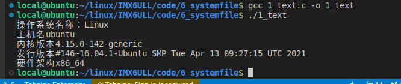
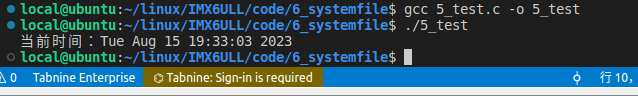
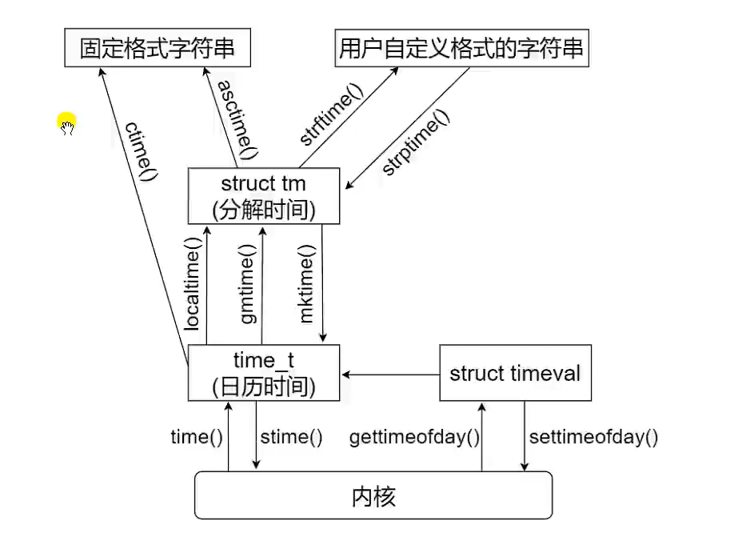

[toc]

### 总结（获取系统信息）

#### 1、utsname结构体

结果



代码

```C
#include <stdio.h>
#include <stdlib.h>
#include <sys/utsname.h>


int main(void)
{
    struct utsname info;
    int ret = 0;

    ret = uname(&info);
    if (-1 == ret) {
        perror("uname error");
        return 1;
    }
    
    printf("操作系统名称：%s\n", info.sysname);
    printf("主机名%s\n", info.nodename);
    printf("内核版本%s\n", info.release);
    printf("发行版本%s\n", info.version);
    printf("硬件架构%s\n", info.machine);

    return 0;

}
```

#### 2、sysinfo结构体

#### 3、获取时间和日期

##### 1、日历时间

```C
#include <stdio.h>
#include <stdlib.h>
#include <time.h>

/**
 * @brief 获取日历时间
 * 
 * @return int 
 */

int main(void)
{
    time_t t;
    
    t = time(NULL);
    if (-1 == t) {
        perror("time error");
        return 1;
    }

    printf("time: %ld\n", t);

    return 0;
}
```

##### 2、更精确的日历时间

```C
#include <stdio.h>
#include <stdlib.h>
#include <sys/time.h>

/**
 * @brief 获取系统当前时间
 * 
 * @return int 
 */
int main(void)
{
    struct timeval tval;
    int ret = 0;

    ret = gettimeofday(&tval, NULL);
    if (-1 == ret) {
        perror("gettimeofday error");
        return 1;
    }

    printf("时间值: %ld 秒+%ld 微秒\n", tval.tv_sec, tval.tv_usec);
    return 0;

}
```

##### 3、ctime()

结果



代码

```C
#include <stdio.h>
#include <stdlib.h>
#include <time.h>

/**
 * @brief 时间点 系统时间 年月日都有
 * 
 * @return int 
 */
int main(void)
{
    char tm_str[100] = {0};
    time_t tm;

    /*获取时间*/
    tm = time(NULL);
    if (-1 == tm) {
        perror("time error");
        return 1;
    }

    /*将时间转换为字符串形式*/
    ctime_r(&tm,tm_str);

    /*打印输出*/
    printf("当前时间：%s", tm_str);
    return 0;
}
```

##### 4、localtime()函数

```C
#include <stdio.h>
#include <stdlib.h>
#include <time.h>

/**
 * @brief 直接打印系统时间 
 * 
 * @return int 
 */
int main(void)
{
    struct tm t;
    time_t sec;

    /*获取时间*/
    sec = time(NULL);
    if (-1 == sec) {
        perror("time error");
        return 1;
    }

    /*转换得到本地时间*/
    localtime_r(&sec, &t);

    /*打印输出*/
    printf("当前时间: %d 年%d 月%d 日 %d:%d:%d\n",
            t.tm_year + 1900, t.tm_mon, t.tm_mday,
             t.tm_hour, t.tm_min, t.tm_sec);

    return 0;
}
```

##### 5、gmtime_r()函数

```C
#include <stdio.h>
#include <stdlib.h>
#include <time.h>

/**
 * @brief 获取系统时间
 * 
 * @return int 
 */
int main(void)
{
    struct tm local_t;
    struct tm utc_t;
    time_t sec;

    /*获取时间*/
    sec = time(NULL);
    if (-1 == sec) {
        perror("time error");
        return 1;
    }

    /*转换得到本地时间*/
    localtime_r(&sec, &local_t);
    /*转换得到国际标准时间*/
    gmtime_r(&sec, &utc_t);

    /*打印输出*/
    printf("本地时间： %d 年%d 月%d 日 %d:%d:%d\n",
        local_t.tm_year + 1900, local_t.tm_mon, local_t.tm_mday,
         local_t.tm_hour, local_t.tm_min, local_t.tm_sec);
    printf("UTC 时间：%d 年%d 月%d 日 %d:%d:%d\n",
            utc_t.tm_year + 1900, utc_t.tm_mon, utc_t.tm_mday,
            utc_t.tm_hour, utc_t.tm_min, utc_t.tm_sec);

    return 0;   
}
```

##### 6、mktime

```C
#include <stdio.h>
#include <stdlib.h>
#include <time.h>

/**
 * @brief mktime
 * 
 * @return int 
 */
int main(void)
{
    struct tm local_t;
    time_t sec;

    /*获取时间*/
    if (-1 == sec) {
        perror("time error");
        return 1;
    }

    printf("获取得到的秒数：%ld\n", sec);
    localtime_r(&sec, &local_t);
    printf("转换得到的秒数：%ld\n",mktime(&local_t));

    return 0;
}
```

##### 7、转换关系



#### 4、进程时间

注意这里不加休眠的时间

```C
#include <stdio.h>
#include <stdlib.h>
#include <sys/times.h>
#include <unistd.h>

/**
 * @brief 进程运行时间
 * 
 * @return int 
 */
int main(void)
{
    struct tms t_buf_start;
    struct tms t_buf_end;
    clock_t t_start;
    clock_t t_end;
    long tck;
    int i, j;

    /*获取系统的节拍率*/
    tck = sysconf(_SC_CLK_TCK);
    /*开始时间*/
    t_start = times(&t_buf_start);
    if (-1 == t_start) {
        perror("times error");
        return 1;
    }

    /*需要测试的代码段*/
    for (i = 0; i < 20000; i++) {
        for (j = 0; j < 20000; j++){
            ;
        }
    }
    sleep(1);//休眠挂起
    /**********  end ******/

    /*结束时间*/
    t_end = times(&t_buf_end);
    if (-1 == t_end) {
        perror("times error");
        return 1;
    }

    /* 打印时间*/
    printf("时间总和: %f 秒\n", (t_end - t_start) / (double)tck);
    printf("用户 cpu 时间：%f 秒\n", (t_buf_end.tms_utime - t_buf_start.tms_utime) / (double)tck);
    printf("系统 cpu 时间：%f 秒\n", (t_buf_end.tms_stime - t_buf_start.tms_stime) / (double)tck);

    return 0;
}
```

#### 5、随机数种子

```C
#include <stdio.h>
#include <stdlib.h>
#include <fcntl.h>
#include <time.h>

/**
 * @brief 生成一个随机数
 * 
 * @return int 
 */
int main(void)
{
    int ret = 0;
//设置随机数种子
    srand(time(NULL));
    for (int i = 0; i < 10; i++) {
        ret = rand();
        printf("%d\n", ret);
    }

    return 0;
}
```

#### 6、秒级休眠sleep()/微秒级休眠usleep()/纳秒级休眠nanosleep()

```C
#include <stdio.h>
#include <stdlib.h>
#include <time.h>

/**
 * @brief 调用纳秒级休眠nanosleep 让程序休眠3秒钟
 * 
 * @return int 
 */
int main(void)
{
    struct timespec request_t;
    puts("sleep start");
    //让程序休眠3秒钟
    request_t.tv_sec = 3;
    request_t.tv_nsec = 0;

    nanosleep(&request_t, NULL);
    puts("sleep end");
    
    exit(0);  
}
```


