[toc]

**author: Brainy **

###	总结（进程）	

#### 1、进程是指正在运行的程序（进程是一种动态的概念）

#### 2、进程的生命周期：从程序启动到程序退出这段时间。

#### 3、在运行main函数之前

1、还会运行一段引导代码，最终由这段引导代码调用 `main函数`，这段引导代码并不需要我们自己编写，而是在编译，链接我们的应用程序的时候由链接器将这段引导代码链接到我们的应用程序中，构成最终的可执行文件，也就是最终的程序。

#### 4、进程终止

##### 1、正常终止：

①譬如在main函数中通过return返回，终止进程。

②调用库函数`exit()`终止进程。

③调用系统调用`_exit`或  `_Exit`。

##### 2、异常终止：

①调用`abort函数`终止进程。

②被信号终止。	

#### 5、exit、 _exit的用法

##### 1、区别

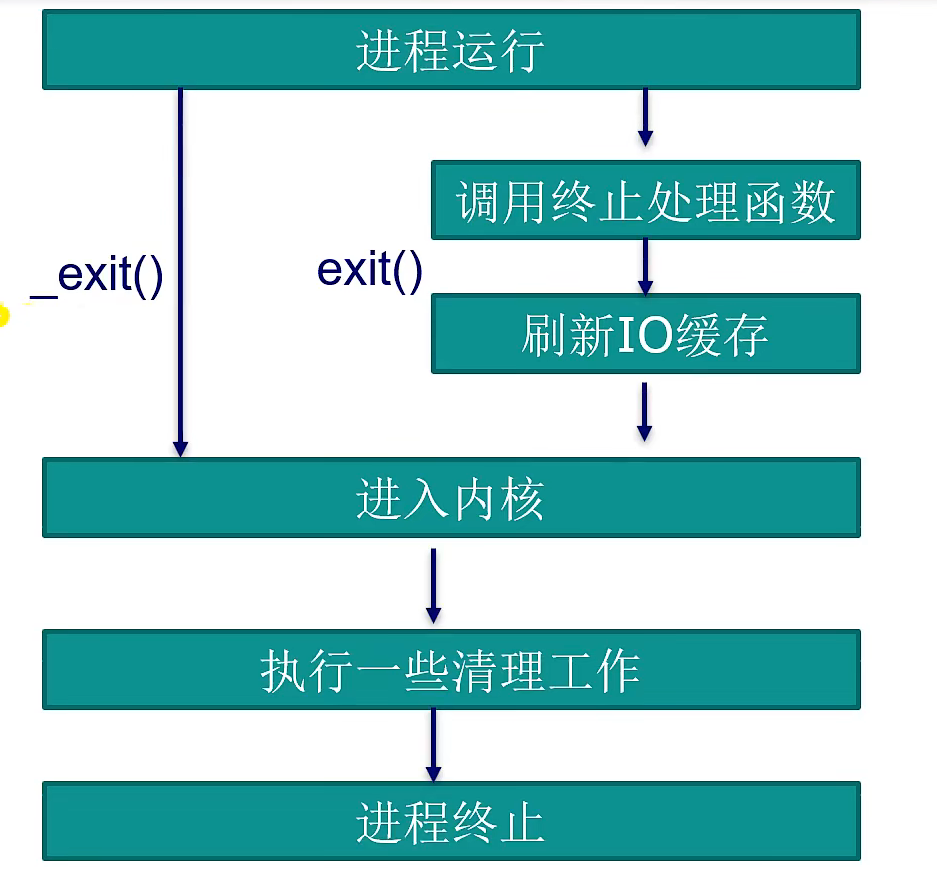

##### 2、exit()和return之间的区别

①exit()是一个库函数，return是**c语言**的语句。

②exit()函数最终会进入到内核，把控制权交给内核，最终由内核去终止进程。

​	执行return并不会进入到**内核**，它只是一个main函数返回，返回到它的上层调用把控制权交给它的上层调用，最终由上层调用终止进程。

#### 6、终止处理atexit()（可以注册多次，也就是可以有多个终止处理函数）

```C
#include <unistd.h>
#include <stdio.h>
#include <stdlib.h>


//终止处理函数
static void bye(void)
{
    printf("goodbye\n");
}
/**
 * @brief 函数在exit后会调用终止处理函数
 * 
 * @return int 
 */
int main(void)
{
    atexit(bye);
    printf("hello world\n");

    sleep(2);
    exit(0);//这个后会调用终止处理函数
    //_exit(0);而这个后不会调用终止处理函数(前面打印的东西，使用这个需要换行符)

    return 0;
}
```

##### 2、多次调用终止处理函数

1、结果

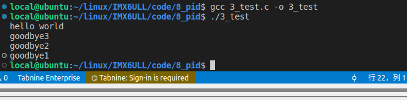

2、代码

```C
#include <unistd.h>
#include <stdio.h>
#include <stdlib.h>


//终止处理函数
static void bye1(void)
{
    printf("goodbye1\n");
}
static void bye2(void)
{
    printf("goodbye2\n");
}
static void bye3(void)
{
    printf("goodbye3\n");
}
/**
 * @brief 函数在exit后会调用终止处理函数
 * 
 * @return int 
 */
int main(void)
{
    atexit(bye1);
    atexit(bye2);
    atexit(bye3);
    printf("hello world\n");

    sleep(2);
    exit(0);

    return 0;
}
```

#### 7、环境变量

##### 1、overflow

```C
env			//可以使用这个命令查看环境变量
echo $PATH		//也可以使用echo $加指定的环境变量查看
export HELLOWORLD=123456		//添加环境变量，这个是举例
unset HELLOWORLD	//删除环境变量
```

##### 2、常见的环境变量

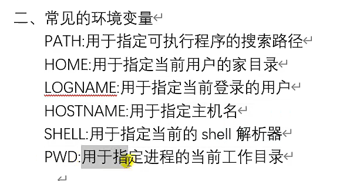

##### 3、获取环境变量（三种方式）

###### ①通过environ变量	获取

```C
#include <stdio.h>
#include <stdlib.h>

//这个指针会指向一个数组，也就是进程的环境表
extern char **environ;

/**
 * @brief 通过这个全局变量可以打印全部的环境变量
 * 
 * @return int 
 */
int main(void)
{
    for (int i = 0; NULL != environ[i]; i++) {
        printf("%s\n", environ[i]);

    }
    return 0;

}
```

###### ②通过int main(int argc,  char *argv[], char *env[])

```C
#include <stdio.h>
#include <stdlib.h>

/**
 * @brief 获取环境变量
 * 
 * @param argc 
 * @param argv 
 * @param env 获取环境变量
 * @return int 
 */
int main(int argc, char *argv[], char *env[])
{
    for (int i = 0; NULL != env[i]; i++) {
        printf("%s\n", env[i]);
    }

    return 0;
}
```

###### ③通过getenv获取

用于获取某个指定的`环境变量`，如果存在该环境变量，则返回该环境变量的值所对应的字符串；如果不存在该环境变量，则返回`NULL`。

需要注意的是，我们不应该去修改该函数返回的字符串，如果修改了这个字符串也就是意味着修改了该环境变量的值。如果要修改变量的值，我们可以通过一些库函数来实现。

结果

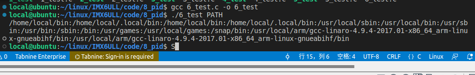

代码

```C
#include <stdio.h>
#include <stdlib.h>

/**
 * @brief 这个需要直接传参进来才可以
 * 
 * @param argc 
 * @param argv 
 * @return int 
 */
int main(int argc, char *argv[])
{
    const char *env = NULL;

    if (2 > argc)
        return 1;

    env = getenv(argv[1]);
    if (NULL == env) {
        printf("getenv error\n");
        return 1;
    }

    printf("%s\n", env);
    return 0;
}
```

##### 4、添加/删除/修改环境变量

###### 1、通过putenv添加/修改环境变量

`putenv函数`可以向进程的环境表中添加一个新的环境变量，也可以修改一个已经存在的环境变量的值；它只有一个参数，这个参数是按照"name=value"这种格式定义的，表示我们要添加或修改的环境变量。

如果进程的环境表中不存在name所指定的环境变量，则调用`putenv`会添加该环境变量；如果环境表中存在该变量，则将其值修改为value所对应的值。

需要注意的是，调用该函数之后，参数string所指向该字符串，因为这个函数内部不会复制一份`string字符串`，而是直接使用它。所以调用`putenv函数`之后，不要去修改string所指向的字符串，否则将会修改到环境变量，所以由此可知，这个string参数不应该是自动变量，因为自动变量的生命周期是函数内部，出了函数之后便不再有效。譬如说可以使用`malloc`分配堆内存，或者直接使用**全局变量**。

代码

```C
#include <stdio.h>
#include <stdlib.h>


extern char **environ;

/**
 * @brief 通过一个for循环打印所有的环境变量
 * 
 * @param argc 
 * @param argv 
 * @return int 
 */
int main(int argc, char *argv[])
{
    int ret = -1;

    if (2 > argc) {
        return 1;
    }

    ret = putenv(argv[1]);
    if (ret) {
        perror("putenv error");
        return 1;
    }
    for (int i = 0; NULL != environ[i]; i++) {
        printf("%s\n", environ[i]);
    }

    return 0;
}
```

###### 2、setenv()函数

效果

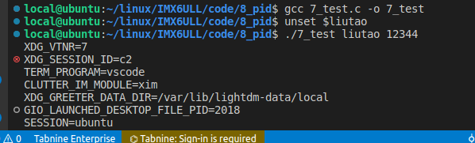

代码

```C
#include <stdio.h>
#include <stdlib.h>


extern char **environ;

/**
 * @brief 通过一个for循环打印所有的环境变量
 * 
 * @param argc 
 * @param argv 
 * @return int 
 */
int main(int argc, char *argv[])
{
    int ret = -1;

    if (3 > argc) {
        return 1;
    }

    ret = setenv(argv[1], argv[2], 0);
    if (ret) {
        perror("setenv error");
        return 1;
    }
    for (int i = 0; NULL != environ[i]; i++) {
        printf("%s\n", environ[i]);
    }

    return 0;
}
```

###### 3、执行程序时 在执行前面添加


###### 4、使用unset删除环境变量

###### 5、清空环境变量

1、直接将environ设置为NULL

2、通过clearenv清空环境变量

#### 8、Linux环境下所有的进程都是由其父进程创建出来的

##### 1、查看系统中的全部进程

```C
pstree
```

##### 2、fork系统调用

1、一次fork调用会产生两次返回值。

为什么会产生两次返回值？

因为调用`fork()函数`会创建一个新的进程(子进程)，调用fork()后会存在两个进程(一个子进程/一个父进程)，

结果

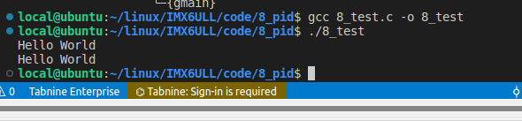

代码

```C
#include <stdio.h>
#include <unistd.h>

/**
 * @brief 调用一次fork 产生两次返回值 子进程的返回值是0，父进程的返回值不为0
 * 
 * @return int 
 */
int main(void)
{
    fork();
    printf("Hello World\n");
    return 0;
}
```

##### 3、父子进程各自互不影响（运行在各自的进程空间中，但是是运行的同一份代码）

结果

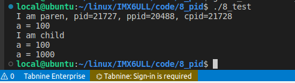

代码

```C
#include <stdio.h>
#include <unistd.h>

/**
 * @brief 调用一次fork 产生两次返回值 但是父子进程互不影响
 * 
 * @return int 
 */
int main(void)
{
    int ret = 0;
    int a = 100;

    ret = fork();
    if (-1 == ret) {
        perror("fork error");
        return 1;
    } else if (0 == ret) {
        printf("I am child\n");
        printf("a = %d\n", a);
        a = 1000;
        printf("a = %d\n", a);
    } else {
        printf("I am paren, pid=%d, ppid=%d, cpid=%d\n", getpid(), getppid(), ret);
        printf("a = %d\n", a);
    }

    return 0;
}
```

##### 4、子进程从fork调用返回后的代码开始运行

子进程从`fork调用`返回后开始运行，虽然子进程和父进程运行在不同的进程空间中，但是他们执行的却是同一个程序。需要注意，子进程运行的是fork调用之后的代码，并不会执行fork调用之前的代码。

#### 9、父、子进程间的文件共享（使用同一个读写指针）

1、多个进程、多个线程对同一个文件进行读写操作

结果（接续写）而不是分别写（如果是分别写就会出现覆盖的情况）	

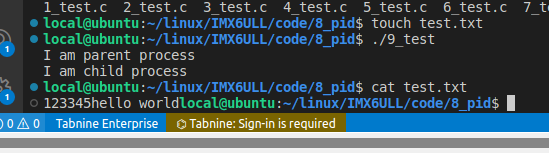

代码

```C
#include <sys/types.h>
#include <unistd.h>
#include <stdio.h>
#include <stdlib.h>
#include <sys/stat.h>
#include <fcntl.h>

/**
 * @brief 在不同的进程中接续写（父子进程）
 * 
 * @return int 
 */
int main(void)
{
    int fd;

    fd = open("./test.txt", O_WRONLY | O_TRUNC);
    if (-1 == fd) {
        perror("open error");
        return 1;
    }

    switch (fork()) {
        case -1:
            perror("fork error");
            close(fd);
            return 1;
        case 0:
            printf("I am child process\n");
            write(fd, "hello world", 11);
            close(fd);
            return 0;
        default:
            printf("I am parent process\n");
            write(fd, "123345", 6);
            close(fd);
            return 0;
    }

    return 0;
}
```

#### 10、父子进程之间的竞争关系（并不能保证父 、子进程谁先返回（但在多数情况下是父进程先返回)）

1、结果

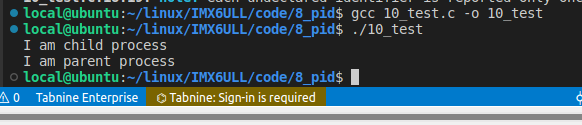

2、代码

```C
#include <sys/types.h>
#include <unistd.h>
#include <stdio.h>
#include <stdlib.h>
#include <sys/stat.h>
#include <fcntl.h>

/**
 * @brief 加一个延时函数就可以保证子进程先运行
 * 
 * @return int 
 */
int main(void)
{
    switch (fork()) {
        case -1:
            perror("fork error");
            return 1;
        case 0:
            printf("I am child process\n");
            return 0;
        default:
            sleep(1);
            printf("I am parent process\n");
            return 0;
    }

    return 0;
}
```

#### 11、监视子进程

##### 1、wait()函数（两个作用）

①、监视子进程什么时候被终止，以及获取子进程终止时的状态信息。

②、回收子进程的一些资源，俗称为`子进程收尸`。

结果

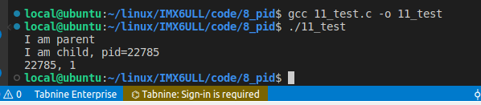

代码

```C
#include <stdio.h>
#include <unistd.h>
#include <sys/types.h>
#include <stdlib.h>
#include <sys/wait.h>

int main(void)
{
    switch (fork()) {
        case -1:
            perror("fork error");
            return 1;
        case 0: //子进程
            printf("I am child, pid=%d\n", getpid());
            return 0;

        default: { //父进程
            int ret = 0;
            int status = 0;

            printf("I am parent\n");
            ret = wait(&status);
            if (-1 == ret) {
                perror("wait error");
                return 1;
            }
            printf("%d, %d\n", ret, WIFEXITED(status));//第二个参数是1 表示子进程正常终止。
            return 0;
        }
    }
    return 0;
}
```

##### 2、waitpid()函数

```C
#include <stdio.h>
#include <stdlib.h>
#include <sys/types.h>
#include <sys/stat.h>
#include <sys/wait.h>
#include <errno.h>


/**
 * @brief 回收子进程
 * 
 * @return int 
 */
int main(void)
{
    int pid = 0;

    pid = fork();
    switch (pid) {
        case -1:
            perror("fork error");
            return 1;
        case 0: //子进程
            printf("I am child, pid=%d\n", getpid());
            exit(0);
        default: { //父进程等待回收子进程
            int ret = 0;
            int status = 0;

            printf("I am parent\n");
            //ret = waitpid(pid, &status, 0);
            ret = waitpid(-1, &status, 0);//表示回收任意子进程，相同与wait(&status)
            if (-1 == ret) {
                perror("wait error");
                return 1;
            }
            /*打印被终止的子进程pid*/
            printf("%d, %d\n", ret, WTERMSIG(status));
            return 0;
        } 
    }
}
```

##### 3、SIGCHLD信号

```C
#include <stdio.h>
#include <stdlib.h>
#include <signal.h>
#include <unistd.h>
#include <sys/types.h>
#include <sys/wait.h>

/**
 * @brief 回收子进程函数
 * 
 * @param sig 
 */
static void wait_child(int sig)
{
    /*替子进程收尸*/
    printf("父进程回收子进程\n");
    while (waitpid(-1, NULL, WNOHANG) > 0) {
        continue;
    }
}

/**
 * @brief 循环回收子进程
 * 
 * @return int 
 */
int main(void)
{
    struct sigaction sig = {0};

    /*SIGCHLD 信号绑定处理函数*/
    sigemptyset(&sig.sa_mask);
    sig.sa_handler = wait_child;
    sig.sa_flags = 0;
    if (-1 == sigaction(SIGCHLD, &sig, NULL)) {
        perror("sigaction error");
        exit(-1);
    }

    /*创建子进程*/
    switch (fork()) {
        case -1:
            perror("fork error");
            exit(-1);
        case 0:
            /*子进程*/
            printf("子进程<%d>被创建\n", getpid());
            sleep(1);
            printf("子进程结束\n");
            _exit(0);
        default:
            /*父进程*/
            break;
    }
    sleep(3);
    exit(0);
    return 0;
}
```

##### 4、孤儿进程(父进程比子进程先终止)

##### 5、僵尸进程（子进程结束后，父进程需要回收子进程的资源，父进程调用（wait()/waitpid()/waitid()）函数回收资源，归还给系统）（没有来得及回收就是僵尸进程）

创建**僵尸进程**

```C
#include <stdio.h>
#include <stdlib.h>
#include <unistd.h>

/**
 * @brief 创建僵尸进程
 * 
 * @return int 
 */
int main(void)
{
    /*创建子进程*/
    switch (fork()) {
        case -1:
            perror("fork error");
            exit(-1);
        case 0:
            /*子进程*/
            printf("子进程<%d>被创建\n", getpid());
            sleep(1);
            printf("子进程结束\n");
            _exit(0);
        default:
            /*父进程*/
            break;
    }
    for( ; ; )
        sleep(1);
    exit(0);
    return 0;
}
```

#### 12、执行新程序（execve系统调用/exec族/system库函数）

**1、exec函数族**

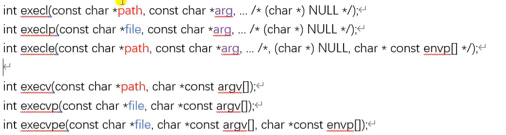

代码

```C
#include <stdio.h>
#include <stdlib.h>
#include <unistd.h>


/**
 * @brief 效果 相当于命令 ls -a -l
 * 
 * @return int 
 */
int main(void)
{
    execl("/bin/ls", "ls", "-a", "-l", NULL);
    perror("execl error");
    exit(-1);
    return 0;
}
```

##### 2、system()函数

```C
#include <stdio.h>
#include <stdlib.h>
#include <unistd.h>


/**
 * @brief system相当于一个shell命令 
 *         还有system内部创建的子进程是正常终止的
 * @return int 
 */
int main(void)
{
    int ret = -1;

    ret = system("ls -al");
    if (-1 == ret) {
        perror("system error");
        return 1;
    }
    printf("%d\n", WIFEXITED(ret));
    return 0;
}
```

##### 3、vfork()函数：不拷贝父进程 

```C
#include <stdio.h>
#include <stdlib.h>
#include <unistd.h>

/**
 * @brief vfork()函数
 * 
 * @return int 
 */
int main(void)
{
    switch (vfork()) {
        case -1:
            perror("vfork error");
            return 1;
        case 0:
            printf("I am child, %d\n", getpid());
            _exit(0);
        default:
            printf("I am parent, %d\n", getpid());
            break;
    }

    exit(0);
    return 0;
}
```

