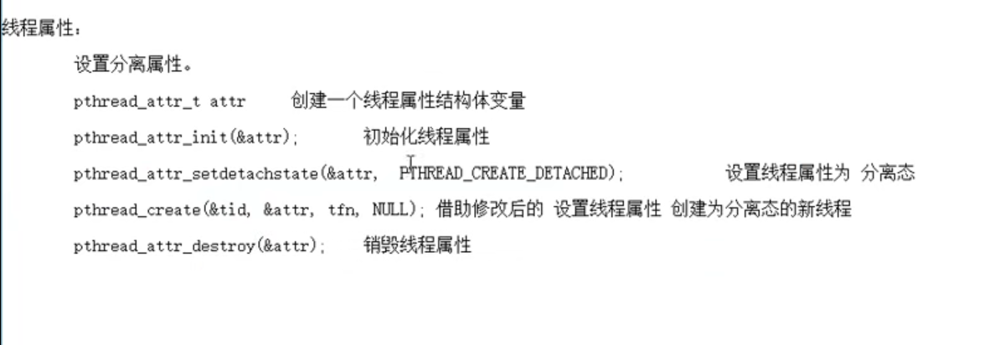

[toc]

### 总结（线程是最小的执行单位）

#### 1、基础函数

1、pthread_self(void); 获取线程id.线程id是在进程地址空间内部，用来标示线程身份的id号。

2、pthread_create(pthread_t *tid, const ptread_attr_t *attr, void * (*start_runtn)(void *), void *arg); 

创建线程

```C
参数1：传出参数，表新创建的子进程ID;
参数2：线程属性。传NULL表使用默认属性;
参数3：子线程回调函数。创建成功，pthread_create函数返回时，该函数就会被自动调用;
参数4：参数3的参数，没有的话，传NULL.

```


```C
#include <stdio.h>
#include <errno.h>
#include <pthread.h>
#include <unistd.h>

void *tfn(void *arg)
{
    printf("thread:pid = %d, tid = %lu\n", getpid(), pthread_self());

    return 0;
}

int main(int argc, char **argv)
{
    pthread_t tid;
    printf("main:pid = %d, tid = %lu\n", getpid(), pthread_self());

    int ret = pthread_create(&tid, NULL, tfn, NULL);
    if (ret != 0) {
        perror("pthread_create error");
    }

    //不能先return 这样会销毁掉整个空间导致，子进程不能运行
    //所以先睡1s
    sleep(1);

    return 0;
}
```

#### 2、循环创建子线程（记住局部变量不可做返回值）

```C
#include <stdio.h>
#include <errno.h>
#include <pthread.h>
#include <unistd.h>
#include <string.h>
#include <stdlib.h>
/**
 * @brief 传参采用值传递，不能使用地址空间传递，因为主线程一直再走 地址空间传递的值，子线程读到不一样
 * 
 * @param argc 
 * @param argv 
 * @return int 
 */
void *tfn(void *arg)
{
    int i = (int)arg;//传递的是void 但是我要用的是int 所以使用强转
    sleep(i);
    printf(" I'm %dth thread:pid = %d, tid = %lu\n", i + 1, getpid(), pthread_self());

    return 0;
}

int main(int argc, char **argv)
{
    int i = 0;
    int ret = 0;
    pthread_t tid;

    for(i = 0; i < 5; i++) {
        ret = pthread_create(&tid, NULL, tfn, (void *)i);
        if (ret != 0) {
            perror("pthread_create error");
            return 1;
        }
    }

    sleep(i);
    printf("main:pid = %d, tid = %lu\n", getpid(), pthread_self());   
    return 0;
}
```

1、**pthread_exit(void *retval);** 退出当前线程；

```C
#include <stdio.h>
#include <stdlib.h>
#include <string.h>
#include <unistd.h>
#include <errno.h>
#include <pthread.h>

struct thrd {
    int var;
    char str[256];
};


void *tfn(void *arg)
{
    printf("tfn\n");
    struct thrd *tval;
    tval = malloc(sizeof(tval));//既然是指针就一定要有空间
    tval->var = 100;
    strcpy(tval->str, "hello thread");


    return (void *)tval;
}
/*
void sys_err(const char *str)
{
    perror(str);
    exit(1);
}
*/
int main(int argc, char **argv)
{
    pthread_t tid;
    struct thrd *retval;

    int ret = pthread_create(&tid, NULL, tfn, NULL);
    if (ret != 0) {
        perror("create errror");
        return 1;
    }

    //回收子线程 子线程的东西也返回在这里
    ret = pthread_join(tid, (void **)&retval);
    if (ret != 0) {
        perror("join errror");
        return 1;
    }
    printf("child thread exit with var = %d, str = %s\n", retval->var, retval->str);

    pthread_exit(NULL);
    
}
```

2、**要使用pthread_cancel()的话，如果有循环需要在循环中使用pthread_testcancel();添加这个取消点。**

3、**pthread_detach()函数实现线程分离** （线程终止，会自动清理pcb，无需回收）

```C
#include <stdio.h>
#include <unistd.h>
#include <stdlib.h>
#include <pthread.h>
#include <errno.h>
#include <string.h>

void *tfn(void *arg)
{
    printf("thread:pid = %d, tid = %lu\n", getpid(), pthread_self());

    return NULL;
}
/**
 * @brief 线程分离 不需要回收，直接就是自动就会终止线程
 * 
 * @param argc 
 * @param argv 
 * @return int 
 */
int main(int argc, char **argv)
{
    pthread_t tid;

    int ret = pthread_create(&tid, NULL, tfn, NULL);
    if (ret != 0) {
        fprintf(stderr,"pthread_create error:%s\n", strerror(ret));
        //perror("create errror");
        return 1;
    }

    ret = pthread_detach(tid);//设置为分离态
    if (ret != 0) {
        fprintf(stderr,"pthread_detach error:%s\n", strerror(ret));//这个可以去查看错误号，对应的是什么
        //perror("create errror");
        return 1;
    }

    sleep(1);

    ret = pthread_join(tid, NULL);
    printf("join ret = %d\n", ret);
    if (ret != 0) {
        fprintf(stderr,"pthread_join error:%s\n", strerror(ret));
        //perror("create errror");
        return 1;
    }

    printf("main:thread:pid = %d, tid = %lu\n", getpid(), pthread_self());

    pthread_exit(NULL);
}
```

4、两个中间

```C
#include <stdio.h>
#include <stdlib.h>
#include <string.h>
#include <unistd.h>
#include <errno.h>
#include <pthread.h>

void *tfn(void *arg)
{
    printf("thread:pid = %d, tid = %lu\n", getpid(), pthread_self());

    return NULL;
}

int main(int argc, char **argv) 
{
    pthread_t tid;
    pthread_attr_t attr;
    //1、开始
    int ret = pthread_attr_init(&attr);//开始的区间
    if (ret != 0) {
        fprintf(stderr, "attr_init error:%s\n", strerror(ret));
        exit(1);
    }
    //2、设置分离属性
    ret = pthread_attr_setdetachstate(&attr, PTHREAD_CREATE_DETACHED);//设置线程属性为 分离属性
    if (ret != 0) {
        fprintf(stderr, "attr_setdetachstate error:%s\n", strerror(ret));
        exit(1);
    }

    //3、参数有变
    ret = pthread_create(&tid, &attr, tfn, NULL);
    if (ret != 0) {
        perror("pthread_create error");
    }

    //4、销毁
    ret = pthread_attr_destroy(&attr);//结束末尾
    if (ret != 0) {
        fprintf(stderr, "attr_destroy error:%s\n", strerror(ret));
        exit(1);
    }


    //5、测试 回收子线程 
    ret = pthread_join(tid, NULL);
    if (ret != 0) {
        fprintf(stderr, "fail join : %s\n", strerror(ret));
        exit(1);
    }
    printf("main: pid = %d, tid = %lu\n", getpid(), pthread_self());

    pthread_exit((void *)0);
}	
```

线程分离属性



#### 3、线程同步(协同)


