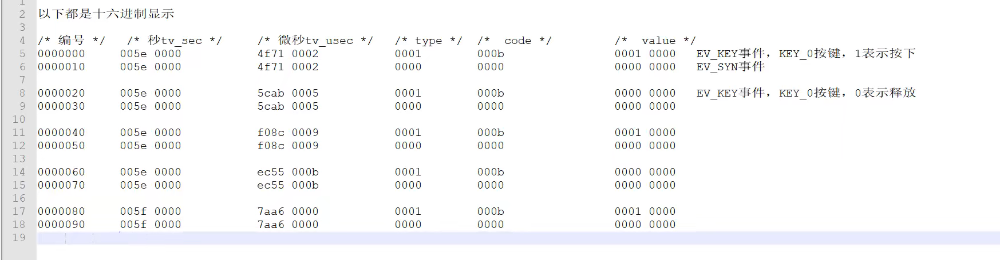

[TOC]

#### 总结

#### 1、简介

input子系统也是字符设备，input核心层会帮我们注册input字符设备驱动，既然内核已经帮我们写好了input驱动，那我们要干啥呢？需要我们去完善具体的输入设备，完善输入设备的时候就要按照input子系统驱动框架的要求来。

#### 2、input_dev

1、申请并初始化并注册input_dev。使用input_allocate_device申请，evbit表示输入事件，比如	按键对应的事件就是EV_KEY,如果要连按，还要加EV_REP。

​		设置按键对应的键值，也就是keybit.

​		初始化完成input_dev以后，需要向内核注册，使用input_register_device.

#### 3、事件上报

1、按键按下以后上报事件，比如对于按键而言就是在按键中断服务函数，或者消抖定时器	函数里面获取按键按下情况，并且上报，可以使用：

​	input_event(struct input_dev *dev,unsigned int type,unsigned int code,int value);

​	对按键而言，也可以使用：input_report_key();

​			使用上面两个函数完成输入事件以后，还需要使用input_sync做同步。

#### 4、input驱动框架

##### 1、加载后可以在一下查看到多了一个event1

```c
ls /dev/input/ -l
```

##### 2、使用以下命令执行后，按下按键后可以查看按下的

```C
hexdump /dev/input/event1 
```

##### 3、完整驱动框架（主要就是几个函数）

```C
#include <linux/module.h>
#include <linux/kernel.h>
#include <linux/init.h>
#include <linux/fs.h>
#include <linux/kernel.h>
#include <linux/slab.h>
#include <linux/delay.h>
#include <linux/uaccess.h>
#include <linux/io.h>
#include <linux/cdev.h>
#include <linux/device.h>
#include <linux/of_irq.h>

#include <linux/of.h>
#include <linux/of_address.h>
#include <linux/of_gpio.h>
#include <asm/mach/map.h>
#include <asm/uaccess.h>
#include <asm/io.h>
#include <linux/timer.h>
#include <linux/jiffies.h>
#include <linux/string.h>
#include <linux/irq.h>
#include <linux/interrupt.h>
#include <linux/input.h>


#define KEYINPUT_CNT     1
#define KEYINPUT_NAME    "keyinput"

#define KEY_NUM         1
#define KEY0VALUE       0X01    /*有效*/
#define INVAKEY         0XFF    /*无效*/
/*key结构体*/
struct irq_keydesc {
        int gpio;               /*io编号*/
        int irqnum;             /*中断号*/
        unsigned char value;    /*键值*/
        char name[10];          /*名字*/   


        irqreturn_t (*handler) (int,void *);       /*中断处理函数*/

};


/*keyinput设备结构体*/
struct keyinput_dev {
        struct device_node *nd;

        struct irq_keydesc irqkey[KEY_NUM];

        struct timer_list timer;        /*定时器*/

        /*输入设备*/
        struct input_dev *inputdev;


};

struct keyinput_dev keyinput; /*irq 设备*/


/*中断处理函数*/
static irqreturn_t key0_handler(int irq,void *dev_id)
{

        struct keyinput_dev *dev = dev_id;

        /*dev_id就是keyinput*/
        dev->timer.data = (volatile unsigned long)dev_id; /*强制类型转换，因为data是括号里面的类型*/
        /*消抖*/
        mod_timer(&dev->timer,jiffies + msecs_to_jiffies(20));         /*10s定时*/

        return IRQ_HANDLED;
}

/*定时器处理函数 进行一个消抖*/
static void timer_func(unsigned long arg)
{
        int value = 0;
        struct keyinput_dev *dev = (struct keyinput_dev *)arg;
        value = gpio_get_value(dev->irqkey[0].gpio);

        if (value == 0) {       /*按下*/
                /*上报按键值*/
                input_event(dev->inputdev,EV_KEY,KEY_0,1);/*按下*/
                /*每上报一个数据都要同步一下*/
                input_sync(dev->inputdev);

        } else if (value == 1) {        /*释放*/
                /*上报按键值*/
                input_event(dev->inputdev,EV_KEY,KEY_0,0);/*释放*/
                input_sync(dev->inputdev);
        }

}

/*按键初始化*/
static int keyio_init(struct keyinput_dev *dev)
{
        int ret = 0;
        int i = 0;

        /*1、按键初始化*/
        dev->nd = of_find_node_by_path("/key");
        if (dev->nd == NULL) {
                ret = -EINVAL;
                goto fail_nd;
        }

        /*2、获取IO的编号 有很多io就用循环获取*/
        for(i = 0; i < KEY_NUM; i++) {
                dev->irqkey[i].gpio = of_get_named_gpio(keyinput.nd,"key-gpios",i);
                if (dev->irqkey[i].gpio < 0) {
                        printk("cat't find io \r\n");
                        ret = -EINVAL;
                        goto fail_gpio;
                }
                printk("get gpio num is %d\r\n",dev->irqkey[i].gpio);
        }

        /*3、申请io 依据上面*/
        for(i = 0; i < KEY_NUM; i++) {
                memset(dev->irqkey[i].name,0,sizeof(dev->irqkey[i].name));
                sprintf(dev->irqkey[i].name,"key%d",i);
                ret = gpio_request(dev->irqkey[i].gpio,dev->irqkey[i].name);
                if (ret) {
                        ret = -EBUSY;
                        printk("IO %d cat't request\r\n",dev->irqkey[i].gpio);
                        goto fail_request;
                }

                /*同时设置io口为输入*/
                ret = gpio_direction_input(dev->irqkey[i].gpio);
                if (ret < 0) {
                        ret = -EINVAL;
                        goto fail_gpioset;
                }

                /*获取中断号*/
                dev->irqkey[i].irqnum = gpio_to_irq(dev->irqkey[i].gpio);

        }


        dev->irqkey[0].handler = key0_handler;
        dev->irqkey[0].value = KEY_0;
        /*4、按键中断初始化*/
        for (i = 0; i < KEY_NUM; i++) {
                /*第三个参数是触发方式*/
                ret = request_irq(dev->irqkey[i].irqnum,key0_handler,
                                        IRQF_TRIGGER_RISING|IRQF_TRIGGER_FALLING,
                                        dev->irqkey[i].name,&keyinput);
                if (ret) {
                        printk("irq %d request failed\r\n",dev->irqkey[i].irqnum);
                        goto fail_irq;
                }
       }


        /*5、初始化定时器*/
        init_timer(&keyinput.timer);
        /*6、注册定时器*/

        /*也就是当timer_func执行的时候它的参数对应的就是timer那个结构体 相当于arg*/
        keyinput.timer.function = timer_func;
        /*data 会传递给定时器的timer_func函数*/

        return 0;
fail_irq:
        for (i = 0; i < KEY_NUM; i++) {
                gpio_free(dev->irqkey[i].gpio);
        }
fail_gpioset:
        gpio_free(dev->irqkey[i].gpio);
fail_request:
fail_gpio:
fail_nd:

        return ret;
}

/*驱动入口函数*/
static int __init keyinput_init(void)
{

        int ret = 0;

        /*1、初始化io*/
        ret = keyio_init(&keyinput);
        if (ret < 0) {
                goto fail_keyinit;
        }

        /*2、注册input_dev*/
        keyinput.inputdev = input_allocate_device();
        if (keyinput.inputdev == NULL) {
                ret = -EINVAL;
                goto fail_keyinit;
        }
        /*3、初始化*/
        keyinput.inputdev->name = KEYINPUT_NAME;
        /*捕获事件有三种方法*/
        /*1*/
        __set_bit(EV_KEY,keyinput.inputdev->evbit);/*设置产生按键事件*/
        __set_bit(EV_REP,keyinput.inputdev->evbit);/*重复事件*/
        __set_bit(KEY_0,keyinput.inputdev->keybit);/*按键值*/

        /*注册*/
        ret = input_register_device(keyinput.inputdev);
        if (ret) {
                
                goto fail_input_register;
        }


        return 0;
fail_input_register:
                input_free_device(keyinput.inputdev);/*释放*/
fail_keyinit:

        return ret;
}

/*驱动出口函数*/
static void __exit keyinput_exit(void)
{
        int i = 0;
        printk("liutao keyinput_exit\r\n");

        /*1、释放中断*/
        for (i = 0; i < KEY_NUM; i++) {
                free_irq(keyinput.irqkey[i].irqnum,&keyinput);
        }

        /*2、释放io 申请后request一定要记得释放，不然会报错*/
        for (i = 0; i < KEY_NUM; i++) {
                gpio_free(keyinput.irqkey[i].gpio);
        }

        /*3、删除定时器*/
        del_timer(&keyinput.timer);
        
        /*4、注销input_dev*/
        input_unregister_device(keyinput.inputdev);
        input_free_device(keyinput.inputdev);


}


module_init(keyinput_init);
module_exit(keyinput_exit);
MODULE_LICENSE("GPL");
MODULE_AUTHOR("liutao");
```

##### 5、输出分析

code表示按键编号 是 11（0x0b)



#### 5、编写应用程序

##### 1、按键驱动对应的文件就是/dev/input/eventX,(X=0,1,2,3..),应用程序读取/dev/input/event1来得到按键信息。也就是按键有没有被按下。

尽量改为BTN

以下两个都在input-event-codes.h里面

```C
#define EV_SYN		0x00
#define EV_KEY		0x01
#define EV_REL		0x02
#define EV_ABS		0x03
#define EV_MSC		0X04
#define EV_SW		0x05
#define EV_LED		0x11
#define EV_SND		0x12
#define EV_REP		0x14
#define EV_FF		0x15
#define EV_PWR		0x16
```

```C
#define BTN_MISC	0x100
#define BTN_0		0x100
#define BTN_1		0x101
#define BTN_2		0x102
#define	BTN_3		0x103
#define BTN_4		0x104
#define BTN_5		0x105
```

##### 2、完整的应用程序

```C
#include "stdio.h"
#include "unistd.h"
#include "sys/types.h"
#include "sys/stat.h"
#include "sys/ioctl.h"
#include "fcntl.h"
#include "stdlib.h"
#include "string.h"
#include <poll.h>
#include <sys/select.h>
#include <sys/time.h>
#include <signal.h>
#include <fcntl.h>
#include <linux/input.h>
/*
 *argc:
 *argv[]:
 * ./keyinputAPP <filename>
 * ./keyinputAPP /dev/input/event1
 * 
*/

/*input_event结构体变量*/
static struct input_event inputevent;


int main(int argc,char *argv[])
{
    int fd,err;
    char *filename;
    unsigned char data;

    if(argc != 2) {
        printf("error usage\r\n");
    }

    filename = argv[1];
    fd = open(filename,O_RDWR);
    if(fd < 0) {
        printf("file %s open failed\r\n",filename);
        return -1;
    }

    /*循环读取*/
    while(1) {
        err = read(fd,&inputevent,sizeof(inputevent));
        if (err > 0) {/*数据读取成功*/
            switch(inputevent.type) {/*type也就是刚刚在开发板上 hexdump 出现的type类型*/
                case EV_KEY:
                    printf("EV_KEY事件\r\n");
                    if (inputevent.code < BTN_MISC) {   /*KEY*/
                        printf("key %d %s\r\n",inputevent.code,inputevent.value?"press":"release");
                    } else {    /*BIN*/
                        printf("button %d %s\r\n",inputevent.code,inputevent.value?"press":"release");
                    }
                    break;
                case EV_SYN:
                    printf("EV_SYN事件\r\n");
                    break;
                case EV_REL:
                    printf("EV_REL事件\r\n");
                    break;
                case EV_ABS:
                    printf("EV_ABS事件\r\n");
                    break;
                default:
                    break;

            }
        } else {
            printf("读取数据失败\r\n");
        }
    }

    close(fd);
    return 0;
}
```

#### 6、内核自带的按键驱动程序

##### 1、其实也就是在内核的图形化界面配置

```C
make menuconfig
```

2、配置内核，选中内核自带的KEY驱动程序，然后会在内核的.config文件中产生：CONFIG_KEYBOARD_GPIO = y;

​	经过查找，内核自带的KEY驱动程序gpio_keys.c,这是一个标准的platform驱动，其中compatible = "gpio-keys",因此我们在设备树中添加对应的节点的时候，其compatible属性必须是"gpio-keys"。

3、内核配置好后，就需要去配置设备树里面的如下

记得需要屏蔽IO，被其他使用

```C
	/*gpio_keys节点*/
	gpio_keys: gpio_keys@0 {
		compatible = "gpio-keys";
		pinctrl-names = "default";
		pinctrl-0 = <&pinctrl_key>;
		#address-cells = <1>;
		#size-cells = <0>;
		autorepeat;

		key1@1 {
			label = "USER-KEY1";
			linux,code = <114>;
			gpios = <&gpio1 18 GPIO_ACTIVE_LOW>;
			gpio-key,wakeup;
		};
	};
```


