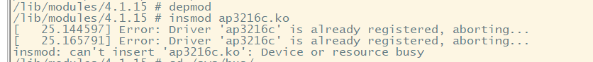

[toc]

## 总结

#### 1、修改设备树，IO，添加AP3216C设备节点。

1、I2C1上接了一个AP3216C,UART4_RXD作为I2C1_SDA,UART4_TXD作为I2C1_SCL

#### 2、记得找到I2C芯片手册，找到其器件地址0x1e（从机地址）（I2C Slave Address）（低七位）

1、有些包含了读写位放在最后，所以器件地址就是去掉末位后的七位16进制数。

```c
&i2c1 {
	clock-frequency = <100000>;
	pinctrl-names = "default";
	pinctrl-0 = <&pinctrl_i2c1>;
	status = "okay";
    
	ap3216c@1e {
		compatible = "liut,ap3216c";
		reg = <0x1e>;//器件地址
	};
};
```

pinctrl子系统

```C
&i2c1 {
	clock-frequency = <100000>;
	pinctrl-names = "default";
	pinctrl-0 = <&pinctrl_i2c1>;
	status = "okay";


	ap3216cliutao@1e {
		compatible = "liut,ltap3216c";
		reg = <0x1e>;
	};
};

    

&iomuxc {
	pinctrl-names = "default";
	pinctrl-0 = <&pinctrl_hog_1>;
	imx6ul-evk {
        
		pinctrl_i2c1: i2c1grp {
			fsl,pins = <
				MX6UL_PAD_UART4_TX_DATA__I2C1_SCL 0x4001b8b0
				MX6UL_PAD_UART4_RX_DATA__I2C1_SDA 0x4001b8b0
			>;
		};
        
	};
};
```

#### 3、可以通过以下命令查看总线是否已经挂载了我们添加的设备

```C
cd sys/bus/i2c/
cd devices/
cd 0-001e/
ls
cat name
```


#### 4、遇到一个问题，如果是用正点原子提供的kernel 那个有可能会出现这种问题。



1、那没办法了。

设备树也找了没有任何问题，就是说重复了。

改：

```C
/*传统的匹配表*/
static const struct i2c_device_id ap3216c_id[] = {
        {"alientek,liutaoap3216c",0},/* 匹配项也是参考内核里面的得来的*/
        {}
};

/*设备树匹配表*/
static const struct of_device_id ap3216c_of_match[] = {
	{ .compatible = "alientek,liutaoap3216c" },
	{ /* Sentinel */ }
};

/* i2c_driver */
static struct i2c_driver ap3216c_driver = {
        .probe  = ap3216c_probe,
        .remove = ap3216c_remove,
        .driver = {
                .name   = "liutaoap3216c",//这个最后也改了才成功的
                .owner  = THIS_MODULE,
                .of_match_table = ap3216c_of_match,
        },
        .id_table = ap3216c_id,
};

```

设备树

```C
	ap3216cliutao@1e {
		compatible = "alientek,liutaoap3216c";
		reg = <0x1e>;
	};
```

#### 5、编写驱动

重点就是通过iic控制器来向ap3216c里面发送或者读取数据。这里使用i2c_transfer这个api函数来完成iic数据的传输。

```C
int i2c_transfer(struct i2c_adapter *adap,struct i2c_msg *msgs,int num)

	adap:IIC设备对应的适配器，也就是IIC接口，当IIC设备和驱动匹配以后，probe函数执行，probe函数传递进来的第一个参数就是i2c_client,在i2c_client里面保存了此I2C设备所对应的i2c_adapter。
    msgs:就是构成的I2C传输数据。
```

##### 1、这三个数据记得查看其类型到底用什么

```C
	unsigned char ir,als,ps;//错的
	unsigned short ir,als,ps;//对的
```

##### 2、完整的驱动程序

```C
#include <linux/types.h>
#include <linux/kernel.h>
#include <linux/delay.h>
#include <linux/ide.h>
#include <linux/init.h>
#include <linux/module.h>
#include <linux/errno.h>
#include <linux/gpio.h>
#include <linux/cdev.h>
#include <linux/device.h>
#include <linux/of_gpio.h>
#include <linux/semaphore.h>
#include <linux/timer.h>
#include <linux/i2c.h>
#include <asm/mach/map.h>
#include <asm/uaccess.h>
#include <asm/io.h>
#include "ap3216creg.h"

#define AP3216C_CNT		1
#define AP3216C_NAME	"ap3216c"

struct ap3216c_dev {
	dev_t devid;            /*设备号*/
	int major;
	int minor;

	struct cdev cdev;

	struct class *class;
	struct device *device;

	struct device_node *nd;

	void *private_data;

	unsigned short ir,als,ps;
};

static struct ap3216c_dev ap3216cdev;

/*读取ap3216c的n个寄存器值*/
static int ap3216c_read_regs(struct ap3216c_dev *dev,u8 reg,void *val, int len)
{
	struct i2c_msg msg[2];

	struct i2c_client *client = (struct i2c_client *)dev->private_data;

	/*msg[0] 发送要读取的寄存器首地址*/
	msg[0].addr = client->addr; 	/*从机地址，也就是ap3216c地址*/
	msg[0].flags = 0;/*表示为要发送的数据*/
	msg[0].buf = &reg;	/*要发送的数据 也就是寄存器地址*/
	msg[0].len = 1;	/*要发送的寄存器地址，长度为1*/


	/*msg[1] 读取数据*/
	msg[1].addr = client->addr; 	/*从机地址，也就是ap3216c地址*/
	msg[1].flags = I2C_M_RD;/*表示读数据*/
	msg[1].buf = val;	/*接收到的从机发送的数据*/
	msg[1].len = len;	/*要读取的寄存器长度*/

	/*第一个参数 i2c设备挂载到了那个i2c接口下面去。*/
	return i2c_transfer(client->adapter,msg,2);

}

/*向ap3216c写n个寄存器的数据*/
static int ap3216c_write_regs(struct ap3216c_dev *dev, u8 reg, u8 *buf, int len)
{
	u8 b[256];
	struct i2c_msg msg;

	struct i2c_client *client = (struct i2c_client *)dev->private_data;

	/*构建要发送的数据，也就是寄存器首地址+实际的数据*/
	b[0] = reg;
	memcpy(&b[1],buf,len);

	/*msg[0] 发送要读取的寄存器首地址*/
	msg.addr = client->addr; 	/*从机地址，也就是ap3216c地址*/
	msg.flags = 0;/*表示为要发送的数据*/
	msg.buf = b;	/*要发送的数据 也就是寄存器地址+实际数据*/
	msg.len = len + 1;	/*要发送的数据长度：寄存器地址长度+实际数据长度*/

	/*第一个参数 i2c设备挂载到了那个i2c接口下面去。*/
	return i2c_transfer(client->adapter,&msg,2);/*msg不是数组了，所以要取指*/
}

/*读取ap3216c一个寄存器*/
static unsigned char ap3216c_read_reg(struct ap3216c_dev *dev, u8 reg)
{
	u8 data = 0;

	ap3216c_read_regs(dev,reg,&data,1);
	return data;


#if 0
	return i2c_smbus_read_byte_data(dev->private_data,reg);
#endif
}
/*向ap3216c一个寄存器写数据*/
static void ap3216c_write_reg(struct ap3216c_dev *dev, u8 reg, u8 data)
{
	u8 buf = 0;

	buf = data;
	ap3216c_write_regs(dev,reg,&buf,1);


}

/*读取数据*/
void ap3216c_readdata(struct ap3216c_dev *dev)
{
    unsigned char buf[6];
    unsigned char i;

	/* 循环读取所有传感器数据 */
    for(i = 0; i < 6; i++)	
    {
        buf[i] = ap3216c_read_reg(dev, AP3216C_IRDATALOW + i);	
    }
	
    if(buf[0] & 0X80) 	/* IR_OF位为1,则数据无效 */
		dev->ir = 0;	
						
	else 				/* 读取IR传感器的数据   		*/
		dev->ir = ((unsigned short)buf[1] << 2) | (buf[0] & 0X03); 			
	
	dev->als = ((unsigned short)buf[3] << 8) | buf[2];	/* 读取ALS传感器的数据 			 */  
	
    if(buf[4] & 0x40)	/* IR_OF位为1,则数据无效 			*/
		dev->ps = 0;    													
	else 				/* 读取PS传感器的数据    */
		dev->ps = ((unsigned short)(buf[5] & 0X3F) << 4) | (buf[4] & 0X0F); 	
}

static int ap3216c_open(struct inode *inode,struct file *filp)
{
	u8 value = 0;
	filp->private_data = &ap3216cdev;
	printk("ap3216c_open\r\n");


	/*初始化ap3216c*/
	ap3216c_write_reg(&ap3216cdev,AP3216C_SYSTEMCONG,0x4);/*复位*/

	mdelay(50);/*驱动里面的延时，50ms*/

	ap3216c_write_reg(&ap3216cdev, AP3216C_SYSTEMCONG, 0x3);/* 开启ALS、PS+IR 		*/

	value = ap3216c_read_reg(&ap3216cdev,AP3216C_SYSTEMCONG);
	printk("AP3216C_SYSTEMCONG = %#x\r\n",value);
	printk("AP3216C_SYSTEMCONG = %d\r\n",value);

	return 0;
}

static int ap3216c_release(struct inode *inode,struct file *filp)
{
        printk("ap3216c_release\r\n");
        return 0;
}

static ssize_t ap3216c_read(struct file *filp,char __user *buf,size_t count,loff_t *ppos)
{
	long err = 0;
	short data[6];
	struct ap3216c_dev *dev = filp->private_data;
	int ret = 0;
	printk("ap3216c_read\r\n");
	/*向应用返回ap3216c的原始数据*/
	ap3216c_readdata(dev);

	data[0] = dev->ir;//红外线强度
	data[1] = dev->als;//光强度
	data[2] = dev->ps;//接近距离

	err = copy_to_user(buf,data,sizeof(data));


	return ret;
}


/*字符设备操作集*/
static const struct file_operations ap3216c_fops = {
        .owner          = THIS_MODULE,
        .open           = ap3216c_open,
        .read          = ap3216c_read,
        .release        = ap3216c_release,
};


static int ap3216c_probe(struct i2c_client *client,const struct i2c_device_id *id)
{
		int ret = 0;
        printk("ap3216c_probe\r\n");

		/*搭建字符设备框架，在/dev/*/
       /*1、注册字符设备驱动*/
        ap3216cdev.major = 0;      /*不给定设备号，由系统自动分配*/
        if (ap3216cdev.major) {            /*给定主设备号*/
                ap3216cdev.devid = MKDEV(ap3216cdev.major,0); /*主设备号和次设备号*/
                register_chrdev_region(ap3216cdev.devid,AP3216C_CNT,AP3216C_NAME);
        } else {        /*没给定设备号*/
                alloc_chrdev_region(&ap3216cdev.devid,0,AP3216C_CNT,AP3216C_NAME);/*第一个参数是申请到的*/
                /*保存申请到的主次设备号*/
                ap3216cdev.major = MAJOR(ap3216cdev.devid);
                ap3216cdev.minor = MINOR(ap3216cdev.devid);
        }
        printk("ap3216cdev major = %d, minor = %d\r\n",ap3216cdev.major,ap3216cdev.minor);

        /*2、初始化cdev*/
        ap3216cdev.cdev.owner = THIS_MODULE;
        cdev_init(&ap3216cdev.cdev,&ap3216c_fops);     /*第二个参数是字符设备操作集*/
        
        /*3、添加cdev 其返回值在实际中要做处理*/
        cdev_add(&ap3216cdev.cdev,ap3216cdev.devid,AP3216C_CNT);

        /*4、创建类*/
        ap3216cdev.class = class_create(THIS_MODULE,AP3216C_NAME);
        if (IS_ERR(ap3216cdev.class)) {    /*由于是指针类型需要判断是否创建成功*/
                return PTR_ERR(ap3216cdev.class);
        }

        /*5、创建设备 感觉也就是相当于在开发板 ls /dev/ 下出现这个设备*/
        ap3216cdev.device = device_create(ap3216cdev.class,NULL,ap3216cdev.devid,NULL,AP3216C_NAME);
        if (IS_ERR(ap3216cdev.device)) {    /*由于是指针类型需要判断是否创建成功*/
                return PTR_ERR(ap3216cdev.device);
        }


		/*私有变量 保存了client*/
		ap3216cdev.private_data = client; 

        return ret;
}

static int ap3216c_remove(struct i2c_client *client)
{
        printk("ap3216c_remove\r\n");
        /*注销字符设备驱动*/
        cdev_del(&ap3216cdev.cdev);
        unregister_chrdev_region(ap3216cdev.devid,AP3216C_CNT);

        /*先创建的类，后创建设备。所以要先销毁设备，再销毁类*/
        device_destroy(ap3216cdev.class,ap3216cdev.devid);
        class_destroy(ap3216cdev.class);

        return 0;
}


/*传统的匹配表*/
static const struct i2c_device_id ap3216c_id[] = {
        {"liut,ltap3216c",0},/* 匹配项也是参考内核里面的得来的*/
        {}
};

/*设备树匹配表*/
static const struct of_device_id ap3216c_of_match[] = {
	{ .compatible = "liut,ltap3216c" },
	{ /* Sentinel */ }
};

/* i2c_driver */
static struct i2c_driver ap3216c_driver = {
        .probe  = ap3216c_probe,
        .remove = ap3216c_remove,
        .driver = {
                .name   = "ltap3216c",
                .owner  = THIS_MODULE,
                .of_match_table = ap3216c_of_match,
				//.of_match_table = of_match_ptr(ap3216c_of_match),
        },
        .id_table = ap3216c_id,
};


/*驱动入口*/
static int __init ap3216c_init(void)
{
        int ret = 0;
        ret = i2c_add_driver(&ap3216c_driver);

        return ret;
}
/*驱动出口*/
static void __exit ap3216c_exit(void)
{
        i2c_del_driver(&ap3216c_driver);

}

module_init(ap3216c_init);
module_exit(ap3216c_exit);
MODULE_LICENSE("GPL");
MODULE_AUTHOR("liutao");
```

##### 3、寄存器

```C
#ifndef AP3216C_H
#define AP3216C_H

/*需要去查找芯片手册*/
/* AP3316C寄存器 */
#define AP3216C_SYSTEMCONG	0x00	/* 配置寄存器 			*/
#define AP3216C_INTSTATUS	0X01	/* 中断状态寄存器 			*/
#define AP3216C_INTCLEAR	0X02	/* 中断清除寄存器 			*/
#define AP3216C_IRDATALOW	0x0A	/* IR数据低字节 			*/
#define AP3216C_IRDATAHIGH	0x0B	/* IR数据高字节 			*/
#define AP3216C_ALSDATALOW	0x0C	/* ALS数据低字节 		*/
#define AP3216C_ALSDATAHIGH	0X0D	/* ALS数据高字节			*/
#define AP3216C_PSDATALOW	0X0E	/* PS数据低字节 			*/
#define AP3216C_PSDATAHIGH	0X0F	/* PS数据高字节 			*/


#endif 

```

##### 4、完整的应用程序

```C
#include "stdio.h"
#include "unistd.h"
#include "sys/types.h"
#include "sys/stat.h"
#include "sys/ioctl.h"
#include "fcntl.h"
#include "stdlib.h"
#include "string.h"
#include <poll.h>
#include <sys/select.h>
#include <sys/time.h>
#include <signal.h>
#include <fcntl.h>
#include <linux/input.h>
/*
 *argc:
 *argv[]:
 * ./ap3216cAPP <filename>
 * ./ap3216cAPP /dev/ap3216c
 * 
*/

int main(int argc,char *argv[])
{
    int fd,err;
    unsigned short data[3];
    unsigned short ir,ps,als;
    char *filename;


    if(argc != 2) {
        printf("error usage\r\n");
    }

    filename = argv[1];
    fd = open(filename,O_RDWR);
    if(fd < 0) {
        printf("file %s open failed\r\n",filename);
        return -1;
    }

    /*循环读取*/
    while(1) {
        err = read(fd,data,sizeof(data));/*数组不取指*/
        if (err == 0) {
            ir = data[0]
            als= data[1]
            ps = data[2]
        }
        printf("ap3216c ir = %d,als = %d,ps = %d\r\n",ir,als,ps);
        usleep(200000);/*200ms*/
    }
    


    close(fd);
    return 0;
}
```

