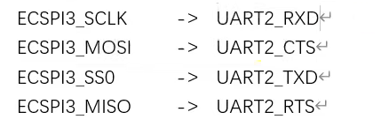

[toc]

## 总结（记得在内核里面的相应的结构体里面去找）（设备树绑定文档也在内核的Documentation这个里面device-tree)

#### 1、spi是四线，全双工的

1、spi具体芯片驱动：ICM20608.

2、主机控制器驱动：soc的spi外设驱动，此驱动是半导体原厂编写好的。为spi-imx.c,当spi控制器的设备和驱动匹配以后，spi_imx_probe函数就会执行，完善I.MX6ULL的spi控制器驱动。

​		spi控制器驱动核心就是spi_master里面就有如何通过spi控制器与spi外设进行通信的函数。，此函数是原厂编写好的。

3、设备驱动：具体的spi芯片驱动。

#### 2、重点spi设备驱动（具体的spi芯片）

1、spi_device:每个spi_device下都有一个spi_master.每个spi设备，肯定挂载到了一个spi控制器，比如ICM20608挂载到了6ull的ECSPI3接口上。

2、spi_driver：非常重要！本讲重点，申请或者 定义一个spi_driver,然后初始化spi_driver中的各个成员变量，当spi设备和驱动匹配以后，spi_driver下的probe函数就会执行。

3、spi_driver初始化成功以后需要向内核注册，函数为：spi_register_driver()。当注销驱动的时候需要：spi_unregister_driver()

#### 3、驱动编写

##### 1、修改设备树，添加IO相关信息

​	

片选信号不作为硬件片选，而是作为普通的GPIO，我们在程序里面自行控制片选引脚。

##### 2、在ECSPI3节点下创建icm20608子节点。

###### 1、可以通过以下命令查看

```C
cd /sys/bus/spi/
ls
cd device/
cd spi2.0
ls
cd of_node//这个下面有 name compatible等
```


###### 2、设备树

```C
//这个是单独的
&ecspi3 {
        fsl,spi-num-chipselects = <1>; /*一个片选 片选低电平有效*/
        cs-gpio = <&gpio1 20 GPIO_ACTIVE_LOW>; /*spi不是硬件，所以不能用cs-gpios 片选引脚 软件片选*/
        pinctrl-names = "default";
        pinctrl-0 = <&pinctrl_ecspi3>;
        status = "okay";

		/*对应的spi芯片子节点 下面名字都是随便取的*/
		spidev0: icm20608@0 { /*@后面的0表示此spi芯片接到那个硬件片选上*/
			compatible = "liutao,icm20608";
			reg = <0>;
			spi-max-frequency = <8000000>;	/*spi时钟频率8MHz 单位Hz*/
		};
};

&iomuxc {
	pinctrl-names = "default";
	pinctrl-0 = <&pinctrl_hog_1>;
	imx6ul-evk {
        
        /*liutao spi*/
        pinctrl_ecspi3: icm20608 {
            fsl,pins = <
                MX6UL_PAD_UART2_RTS_B__ECSPI3_MISO        0x10b1  /* MISO*/
                MX6UL_PAD_UART2_CTS_B__ECSPI3_MOSI        0x10b1  /* MOSI*/
                MX6UL_PAD_UART2_RX_DATA__ECSPI3_SCLK      0x10b1  /* CLK*/
                MX6UL_PAD_UART2_TX_DATA__GPIO1_IO20       0x10b0  /* CS*/			
                >;
        };
        
	};
};
```

###### 3、基本驱动框架

```C
#include <linux/types.h>
#include <linux/kernel.h>
#include <linux/delay.h>
#include <linux/ide.h>
#include <linux/init.h>
#include <linux/module.h>
#include <linux/errno.h>
#include <linux/gpio.h>
#include <linux/cdev.h>
#include <linux/device.h>
#include <linux/of_gpio.h>
#include <linux/semaphore.h>
#include <linux/timer.h>
#include <linux/i2c.h>
#include <asm/mach/map.h>
#include <asm/uaccess.h>
#include <asm/io.h>
#include <linux/spi/spi.h>


#define ICM20608_CNT		1
#define ICM20608_NAME	"icm20608"

struct icm20608_dev {
	dev_t devid;            /*设备号*/
	int major;
	int minor;

	struct cdev cdev;

	struct class *class;
	struct device *device;

	struct device_node *nd;

	void *private_data;

};

static struct icm20608_dev icm20608dev;

static int icm20608_open(struct inode *inode,struct file *filp)
{


	return 0;
}

static int icm20608_release(struct inode *inode,struct file *filp)
{
        printk("icm20608_release\r\n");
        return 0;
}

static ssize_t icm20608_read(struct file *filp,char __user *buf,size_t count,loff_t *ppos)
{

	return 0;

}


/*字符设备操作集*/
static const struct file_operations icm20608_fops = {
        .owner          = THIS_MODULE,
        .open           = icm20608_open,
        .read          	= icm20608_read,
        .release        = icm20608_release,
};

static int icm20608_probe(struct spi_device *spi)
{
		int ret = 0;
        printk("icm20608_probe\r\n");

		/*搭建字符设备框架，在/dev/*/
       /*1、注册字符设备驱动*/
        icm20608dev.major = 0;      /*不给定设备号，由系统自动分配*/
        if (icm20608dev.major) {            /*给定主设备号*/
                icm20608dev.devid = MKDEV(icm20608dev.major,0); /*主设备号和次设备号*/
                register_chrdev_region(icm20608dev.devid,ICM20608_CNT,ICM20608_NAME);
        } else {        /*没给定设备号*/
                alloc_chrdev_region(&icm20608dev.devid,0,ICM20608_CNT,ICM20608_NAME);/*第一个参数是申请到的*/
                /*保存申请到的主次设备号*/
                icm20608dev.major = MAJOR(icm20608dev.devid);
                icm20608dev.minor = MINOR(icm20608dev.devid);
        }
        printk("icm20608dev major = %d, minor = %d\r\n",icm20608dev.major,icm20608dev.minor);

        /*2、初始化cdev 注册字符设备*/
        icm20608dev.cdev.owner = THIS_MODULE;
        cdev_init(&icm20608dev.cdev,&icm20608_fops);     /*第二个参数是字符设备操作集*/
        
        /*3、添加cdev 其返回值在实际中要做处理*/
        cdev_add(&icm20608dev.cdev,icm20608dev.devid,ICM20608_CNT);

        /*4、创建类*/
        icm20608dev.class = class_create(THIS_MODULE,ICM20608_NAME);
        if (IS_ERR(icm20608dev.class)) {    /*由于是指针类型需要判断是否创建成功*/
                return PTR_ERR(icm20608dev.class);
        }

        /*5、创建设备 感觉也就是相当于在开发板 ls /dev/ 下出现这个设备*/
        icm20608dev.device = device_create(icm20608dev.class,NULL,icm20608dev.devid,NULL,ICM20608_NAME);
        if (IS_ERR(icm20608dev.device)) {    /*由于是指针类型需要判断是否创建成功*/
                return PTR_ERR(icm20608dev.device);
        }

		/*设置icm20608的私有数据*/
		icm20608dev.private_data = spi;

        return ret;
}
static int icm20608_remove(struct spi_device *spi)
{
	int ret = 0;

	printk("icm20608_remove\r\n");

	/*注销字符设备驱动*/
	cdev_del(&icm20608dev.cdev);
	unregister_chrdev_region(icm20608dev.devid,ICM20608_CNT);

	/*先创建的类，后创建设备。所以要先销毁设备，再销毁类*/
	device_destroy(icm20608dev.class,icm20608dev.devid);
	class_destroy(icm20608dev.class);

	return ret;

}


/*传统匹配表*/
struct spi_device_id icm20608_id[] = {
	{"liutao,icm20608",0},
	{}
};

/*设备树匹配表*/
static const struct of_device_id icm20608_of_match[] = {
	{ .compatible = "liutao,icm20608"},
	{ }
};

/*spi_driver*/
struct spi_driver icm20608_driver = {
	.probe 		= icm20608_probe,
	.remove 	= icm20608_remove,
	.driver 	= {
		.name			= "icm20608",
		.owner			= THIS_MODULE,
		.of_match_table	= icm20608_of_match,
	},
	.id_table 	= icm20608_id, 	

};

/*驱动入口*/
static int __init icm20608_init(void)
{
        int ret = 0;

		/*注册*/
		ret = spi_register_driver(&icm20608_driver);

        return ret;
}
/*驱动出口*/
static void __exit icm20608_exit(void)
{
	/*注销*/
	spi_unregister_driver(&icm20608_driver);

}

module_init(icm20608_init);
module_exit(icm20608_exit);
MODULE_LICENSE("GPL");
MODULE_AUTHOR("liutao");
```

##### 3、需要初始化icm20608芯片，然后从里面读取原始数据，这个过程就要用到如何使用Linux内的spi驱动API来读写ICM20608.

​		1、用到两个重要的结构体：spi_transfer和spi_message

​		spi_transfer用来构建收发数据内容。

​		构建spi_transfer,然后将其打包到spi_message里面，需要对spi_message_init初始化spi_message,然后在使用spi_message_add_tail将spi_transfer添加到spi_message里面，最终使用spi_sync和spi_async来发送。

#### 4、无论什么有申请一定要记得释放 比如内存、io等

#### 5、这节暂时有点难，后面再补充（驱动没写好）

